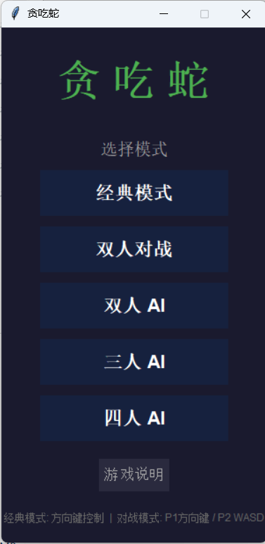
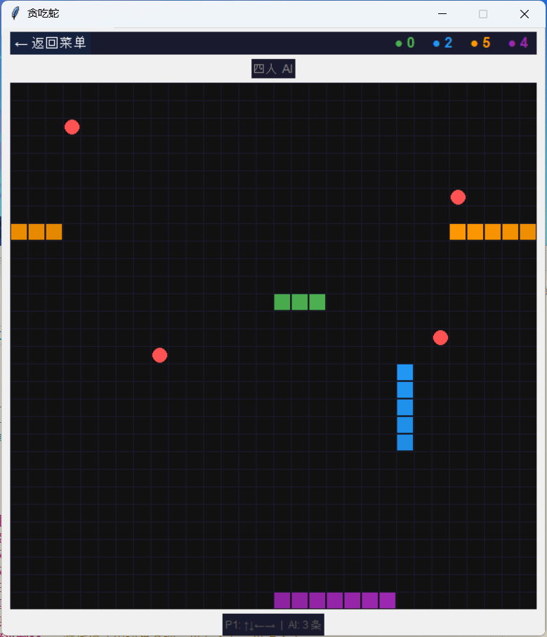

# 对战贪吃蛇

[](LICENSE)


经典贪吃蛇 + 多蛇对战，支持 AI 对手。用 Python 标准库 tkinter 编写，零外部依赖。

**声明**: 本项目由deepseek-v4编写，作者仅负责提供提示词、运行环境、bug反馈和配置修改。项目主要以测试模型能力为目的，消耗token约12元（按v4-pro的缓存命中、缓存未命中、输出价格分别为1、12、24元/百万tokens计算）。

---

## 截图


| 主菜单 | 游戏画面 |
|--------|----------|
|  |  |


## 功能

- **5 种模式**
  - **经典模式** — 单人闯关，撞墙即死，速度递增
  - **双人对战** — P1(方向键) vs P2(WASD)，穿墙，多食物，存活者胜
  - **双人 AI** — 1 人 + 1 AI 蛇对战
  - **三人 AI** — 1 人 + 2 AI 蛇对战
  - **四人 AI** — 1 人 + 3 AI 蛇对战
- **AI 系统** — BFS 洪泛 + 空间控制，攻击性自然涌现（包围、截断、击杀）
- **穿墙机制** — 对战模式中边界互通，出左入右，出上入下
- **多食物** — 对战时地图上同时存在多个食物
- **头部对撞** — 两蛇头碰头双方都死亡，先撞身体者死
- **可配置** — 地图大小、食物数量、速度、颜色等集中在 `config.py`

---

## 操作

| 玩家 | 控制 |
|------|------|
| P1 | ↑ ↓ ← → |
| P2 | W A S D |

| 通用 | 按键 |
|------|------|
| 开始（经典模式） | 任意方向键 |
| 重新开始 | R |
| 返回菜单 | ESC |

---

## 下载

从 [Releases](https://github.com/HUwUH/snake-game/releases) 页面下载 `贪吃蛇.zip`，解压后双击 `贪吃蛇.exe` 即可运行。

> 无需安装 Python 或任何依赖。

---

## 从源码运行 / 编译

### 环境要求

- Python 3.10+
- [uv](https://github.com/astral-sh/uv)（推荐）或 pip

### 安装与运行

```bash
# 克隆仓库
git clone https://github.com/HUwUH/snake-game.git
cd snake-game

# 同步环境（uv 自动创建 venv）
uv sync

# 运行游戏
uv run snake
```

### 打包为 exe

```bash
uv sync                    # 确保环境就绪
uv run python build.py     # 运行构建脚本
# 输出: dist/贪吃蛇.exe
```

构建脚本使用 PyInstaller，生成单文件免安装可执行程序。

---

## 配置

所有可调参数在 `snake_game/config.py` 中：

| 参数 | 默认值 | 说明 |
|------|--------|------|
| `CLASSIC_GRID_WIDTH` / `HEIGHT` | 20×20 | 经典模式地图 |
| `BATTLE_GRID_WIDTH` / `HEIGHT` | 30×30 | 对战模式地图 |
| `FOOD_COUNT` | 4 | 同时存在的食物数 |
| `CELL_SIZE` | 30 | 每格像素 |
| `INITIAL_SPEED_MS` | 200 | 起始速度 (ms/tick) |
| `MIN_SPEED_MS` | 80 | 最快速度 |
| `SNAKE_COLORS` | 5 色 | 各蛇颜色 |
| AI 权重 | 见 `ai.py` | 空间、食物、攻击权重 |

---

## 项目结构

```
snake-game/
├── launcher.py            # PyInstaller 启动脚本
├── build.py               # 打包构建脚本
├── pyproject.toml         # 项目配置 & uv 入口点
├── LICENSE                # MIT 协议
├── snake_game/
│   ├── __init__.py
│   ├── main.py            # 入口
│   ├── config.py          # 集中配置
│   ├── snake.py           # 蛇实体（移动、碰撞）
│   ├── food.py            # 多食物管理器
│   ├── ai.py              # BFS 洪泛 AI
│   ├── menu.py            # 主菜单 & 游戏说明
│   ├── game.py            # 游戏核心循环
│   └── modes/
│       ├── classic.py     # 经典模式
│       └── battle.py      # 对战模式
└── screenshots/           # 截图（可选）
```

---

## 技术栈

- **语言:** Python 3.10+
- **GUI:** tkinter（标准库）
- **构建:** uv + PyInstaller
- **外部依赖:** 零

AI 采用 Battlesnake 方案：BFS 洪水填充计算可达空间，对每个方向模拟移动后评估己方空间增减与对手空间压缩，综合食物距离评分，选择最优方向。

---

## License

[MIT](LICENSE)
